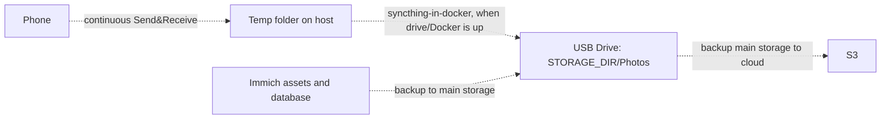

# Self-hosted Photo Library

## Table of Contents
- [My Pipeline](#my-pipeline)
- [Setup](#setup)
  - [Syncthing](#syncthing)
  - [Configs](#configs)
  - [Immich](#immich)
  - [S3 setup](#s3-setup)
  - [Backups](#backups)
- [Duplicates Resolution](#duplicates-resolution)
- [Scripts](#scripts)
- [What's missing / TODO](#whats-missing--todo)

## My Pipeline
1. You make a photo on your phone
2. [syncthing](https://syncthing.net/) running on the host (Send & Receive) copies phone data to a temp folder — this happens regardless of whether the external drive or Docker is up
3. a **second syncthing**, running as a container alongside Immich, picks up from the temp folder and writes into `$STORAGE_DIR/Photos` on the external USB drive whenever the drive/Docker is available
4. [Immich](https://immich.app/) is used to browse and edit the collection, reading from that same folder.
5. **rclone** backs up the main storage to S3

Setup looks complicated, but it is built gradually:
* first, I had a **syncthing** saving my photos to a temp folder on host, and I lived like this for a couple of years
* next, I decided to have another copy on external drive, so I wrote a simple **rsync** script and scheduled it via launchd
* then, I tried **Immich** as a collection browser/deduplicator and it is just great
* then, I added a **second syncthing** as a container that picks up from the temp folder and writes into Immich's storage folder, replacing the rsync hop. The external drive isn't 100% reliable and can be unplugged, and Docker itself can be down — keeping the host-level syncthing → temp folder step means the backup from the phone always lands somewhere even then. This also sets things up for an eventual move to a NAS, where the container syncthing and Immich would just point at a network share instead of a local drive
* and finally, I added **rclone** to back up the main storage to S3



## Setup

### Syncthing
Two syncthing instances are involved:
1. **Host syncthing** (installed per the official docs) — Send & Receive with the phone into a temp folder. This is the part that always works even if the external drive is unplugged or Docker is down.
2. **Container syncthing** (`docker-compose.yml`, alongside Immich) — syncs from that same temp folder into `$STORAGE_DIR/Photos`, the folder Immich reads. Web UI on port `8385`, sync protocol on `22001`; its config lives in `$IMMICH_DIR/syncthing-config` so it survives restarts.

Nuance: connecting two syncthing instances on the *same host* over local discovery is flaky. Set an explicit LAN address (host IP + port, e.g. `tcp://127.0.0.1:22000`) on each side's device config instead of relying on auto-discovery — it connects reliably that way.

This setup also anticipates an eventual move to a NAS: once storage lives there, the container syncthing and Immich would just point at a network share instead of a local USB drive.

### Configs
Create your configuration from **example** files:
* `.env.example` → `.env` — Immich/API secrets (`DB_PASSWORD`, `IMMICH_DEDUP_API_KEY`) and the host paths `docker-compose.yml` mounts (`IMMICH_DIR`, `STORAGE_DIR`).
* `scripts/.env.example` → `scripts/.env` — everything the shell scripts need: phone/storage paths, AWS account/bucket, and the `rclone` remote's access keys. Source it before running any script by hand, e.g. `set -a; source scripts/.env; set +a`.

### Immich
```
docker compose up -d
```

### S3 setup
1. Fill in `AWS_ACCOUNT_ID`, `AWS_BUCKET` and `EMAIL` in `scripts/.env`.
2. Run the commands in `scripts/aws_setup.sh` one at a time (`aws configure` first, then bucket creation, public-access block, encryption, IAM user/policy for `rclone`, and a $1 budget alert). It's a reference list, not a script meant to be executed as a whole — review each command before running it.
3. Put the access key/secret it prints into `RCLONE_ACCESS_KEY` / `RCLONE_SECRET_ACCESS_KEY` in `scripts/.env`.
4. Walk through `scripts/rclone_setup.sh` to configure the `rclone` remote and verify it with a dry-run and a small test upload before trusting it with the real library.

### Backups
- Phone → temp folder: **host syncthing** does it continuously, independent of the external drive or Docker.
- Temp folder → primary drive: **container syncthing** does it continuously whenever the drive/Docker is up.
- Primary drive → S3 (`DEEP_ARCHIVE`): manual (`backup_photos_to_s3.sh`).
- Immich assets + Postgres → primary drive: manual, run after stopping Immich (`backup_immich.sh`).

> `backup_photos.sh` / `backup_photos2.sh` (rsync from the temp folder to primary/secondary drive, `backup_photos.sh` previously scheduled via `scripts/com.user.backup_photos.plist`) are leftover from the pre-syncthing-container pipeline and no longer run as part of the active flow. There is currently no automated copy to a secondary drive.

## Duplicates Resolution
Immich has a built-in functionality but when there are just too many duplicates with same names you can use `scripts/duplicate_resolver.py` to automatically delete these duplicates. 

It calls the Immich API to find duplicate groups (via the ML duplicate-detection job), keeps the earliest-dated asset per group, and deletes the rest. Requires `IMMICH_URL` and `IMMICH_DEDUP_API_KEY` env vars (see `.env.example`). Supports `--dry-run` / `--execute` and `--allow-name-mismatch`; logs every decision to `duplicate_resolver.log`. 

The images will be moved to bin, so you can restore them if needed.

## Scripts
- `scripts/backup_immich.sh` — backs up Immich assets and stops/starts the Postgres container to safely copy `postgres-data`. Run manually after stopping Immich.
- `scripts/aws_setup.sh` — one-off commands to create the S3 bucket (with public access blocked and default encryption), an IAM user/policy scoped to it for `rclone`, and a monthly cost-guard budget alert. Reference commands to run by hand, not an idempotent script.
- `scripts/rclone_setup.sh` — one-off `rclone config` + a dry-run and small test upload to verify the S3 remote before trusting it with a real sync.
- `scripts/backup_photos_to_s3.sh` — syncs `$STORAGE_DIR/Photos` to the S3 bucket under the `DEEP_ARCHIVE` storage class (`--size-only`, so it's cheap to re-run). Not currently scheduled; run manually.
- `scripts/duplicate_resolver.py` — calls the Immich API to find duplicate groups (via the ML duplicate-detection job), keeps the earliest-dated asset per group, and deletes the rest. Requires `IMMICH_URL` and `IMMICH_DEDUP_API_KEY` env vars (see `.env.example`). Supports `--dry-run` / `--execute` and `--allow-name-mismatch`; logs every decision to `duplicate_resolver.log`.

## What's missing / TODO
- **S3 sync isn't scheduled**: `backup_photos_to_s3.sh` has to be run by hand, so the offsite copy can silently fall behind.
- **No restore procedure documented**: there are backup scripts but no tested/written steps for restoring Immich (assets + Postgres dump), photos from a backup copy, or the S3 archive.
- **No scheduling for `backup_immich.sh`**: it's manual, so it's easy to forget to back up Immich's assets and database.
- **No syncthing/backup monitoring or alerting**: nothing checks syncthing's sync status or notifies on failure (drive not mounted, sync stalled, etc.).
- **`duplicate_resolver.py` defaults to a dry delete**: `delete_assets()` currently hardcodes `force=False` (see the `# TODO` in the source) even in `--execute` mode, so duplicates are only trashed, not permanently removed, until that's changed intentionally.
- **No automated tests** for `duplicate_resolver.py`'s grouping/keep logic.
