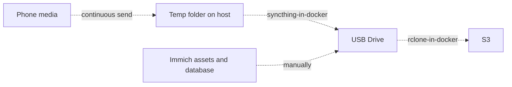

# Self-hosted Photo Library

## Table of Contents
- [My Pipeline](#my-pipeline)
- [Setup](#setup)
  - [Syncthing](#syncthing)
  - [Configs](#configs)
  - [Immich](#immich)
  - [S3 setup](#s3-setup)
  - [Backups](#backups)
- [Duplicates Resolution](#duplicates-resolution)
- [Scripts](#scripts)
- [What's missing / TODO](#whats-missing--todo)

## My Pipeline
1. [syncthing](https://play.google.com/store/apps/details?id=com.github.catfriend1.syncthingandroid&hl=en) running on your phone (Send Only) publishes media to your host.
2. [syncthing](https://syncthing.net/) running on the host (Send & Receive) copies phone data to a temp folder — this happens regardless of whether the external drive or Docker is up
3. a **second syncthing**, running as a container alongside Immich (Send & Receive), picks up from the temp folder and writes into `$STORAGE_DIR/Photos` on the external USB drive whenever the drive/Docker is available
4. [Immich](https://immich.app/) is used to browse and edit the collection, reading from that same folder.
5. **rclone** backs up the main storage to S3

Setup looks complicated, but it is built gradually and you are free to stop at any step and still have a working backup of your phone photos. The steps I took were:
* first, I had a **syncthing** saving my photos to a temp folder on host, and I lived like this for a couple of years
* next, I decided to have another copy on external drive, so I wrote a simple **rsync** script and scheduled it via launchd
* then, I tried **Immich** as a collection browser/deduplicator and it is just great, I almost forgot how much I loved Google Photos
* then, I added a **second syncthing** as a container that picks up from the temp folder and writes into Immich's storage folder, replacing the rsync hop. The external drive isn't 100% reliable and can be unplugged, and Docker itself can be down — keeping the host-level syncthing → temp folder step means the backup from the phone always lands somewhere even then. This also sets things up for an eventual move to a NAS, where the container syncthing and Immich would just point at a network share instead of a local drive
* and finally, I added container with **rclone** to back up the main storage to S3 regularly



A quick note, if you have internal drive big enough for your media - lucky you are! No need to have a temp folder on host, you can just point Immich to the internal drive and skip the second syncthing. But if you have a small internal drive and want to keep your media on an external drive, this setup is for you.

## Setup

### Syncthing
Three syncthing instances are involved:
1. **Phone syncthing** (Send Only) — sends photos to the host's temp folder.
2. **Host syncthing** (Send & Receive) — stores the phone media into a temp folder and relays further. This is the part that always works even if the external drive is unplugged or Docker is down.
3. **Container syncthing** (Send & Receive) — syncs from that same temp folder into `$STORAGE_DIR/Photos`, the folder Immich reads. 

Important: folder modes should be exactly as described above
* on phone - "Send Only" because you don't want to transfer files **to** phone, and you don't want deletes to propagate back to phone
* on host - "Send & Receive" because you want to receive from phone and send to container syncthing
* on container - "Send & Receive" because you want to receive from host and send deletes back to host

Nuance: connecting two syncthing instances on the *same host* over local discovery is flaky. Set an explicit LAN address (host IP + port, e.g. `tcp://127.0.0.1:22000`) on each side's device config instead of relying on auto-discovery — it connects reliably that way.

This setup also anticipates an eventual move to a NAS: once storage lives there, the container syncthing and Immich would just point at a network share instead of a local USB drive.

### Configs
Create your configuration from **example** files:
* `.env.example` → `.env` — Immich/API secrets (`DB_PASSWORD`, `IMMICH_DEDUP_API_KEY`), the host paths `docker-compose.yml` mounts (`IMMICH_DIR`, `STORAGE_DIR`), and `IMMICH_DOMAIN` for the `caddy` reverse proxy.
* `scripts/.env.example` → `scripts/.env` — everything the shell scripts need: phone/storage paths, AWS account/bucket, and the `rclone` remote's access keys. Source it before running any script by hand, e.g. `set -a; source scripts/.env; set +a`.

### HTTPS access (Caddy)
`caddy` reverse-proxies `immich-server` and gets/renews a Let's Encrypt cert automatically for `IMMICH_DOMAIN`. Requirements:
1. Point `IMMICH_DOMAIN`'s DNS at this host's public IP (a DDNS hostname works, e.g. `immich.funduckdev.ddns.net`).
2. Forward ports 80 and 443 from your router to this host (80 is needed for the ACME HTTP-01 challenge, not just redirects).
3. Set `IMMICH_DOMAIN` in `.env`.

Once up, Immich is reachable at `https://$IMMICH_DOMAIN`. `immich-server`'s port is no longer published to the host directly — only `caddy` is.

### S3 setup
1. Fill in `AWS_ACCOUNT_ID`, `AWS_BUCKET` and `EMAIL` in `scripts/.env`.
2. Run the commands in `scripts/aws_setup.sh` one at a time — it's a reference list, not a script meant to be executed as a whole, so review each command before running it. It covers:
   - `aws configure`
   - bucket creation
   - public-access block
   - default encryption
   - an IAM user/policy scoped for `rclone`
   - a $1 budget alert
3. Put the access key/secret it prints into `RCLONE_ACCESS_KEY` / `RCLONE_SECRET_ACCESS_KEY` in both `scripts/.env` and the root `.env` (see [Configs](#configs)).
4. Bring up `docker compose up -d rclone-s3-sync`.
   - It generates its own `rclone.conf` from those env vars.
   - By default (`RCLONE_SYNC_DRY_RUN=true`) it runs a dry-run sync on startup — check `docker logs rclone_s3_sync` to verify it lists the right files before trusting it with the real library.
   - Once verified, set `RCLONE_SYNC_DRY_RUN=false` in `.env` and restart the container.
   - For ad hoc `rclone` CLI checks against the same credentials (e.g. `rclone lsd`), exec into the running container and reuse the config it already generated: `docker exec rclone_s3_sync rclone lsd $RCLONE_REMOTE:$AWS_BUCKET --config /tmp/rclone.conf`.

### Start
```
docker compose up -d 
```

## Duplicates Resolution
Immich has a built-in functionality but when there are just too many duplicates with same names you can use `scripts/duplicate_resolver.py` to automatically delete these duplicates. 

It calls the Immich API to find duplicate groups (via the ML duplicate-detection job), keeps the earliest-dated asset per group, and deletes the rest.  

* Requires `IMMICH_URL` and `IMMICH_DEDUP_API_KEY` env vars (see `.env.example`).  
* Supports `--dry-run` / `--execute` and `--allow-name-mismatch`; logs every decision to `duplicate_resolver.log`. 

The images will be moved to bin, so you can restore them if needed, otherwise empty the bin and the images will be removed from the drive.

## What's missing / TODO
- **No restore procedure documented**: there are backup scripts but no tested/written steps for restoring Immich (assets + Postgres dump), photos from a backup copy, or the S3 archive.
- **No scheduling for `backup_immich.sh`**: it's manual, so it's easy to forget to back up Immich's assets and database.
- **No syncthing/backup monitoring or alerting**: nothing checks syncthing's sync status or notifies on failure (drive not mounted, sync stalled, etc.).
- **`duplicate_resolver.py` defaults to a dry delete**: `delete_assets()` currently hardcodes `force=False` (see the `# TODO` in the source) even in `--execute` mode, so duplicates are only trashed, not permanently removed, until that's changed intentionally.
- **No automated tests** for `duplicate_resolver.py`'s grouping/keep logic.
