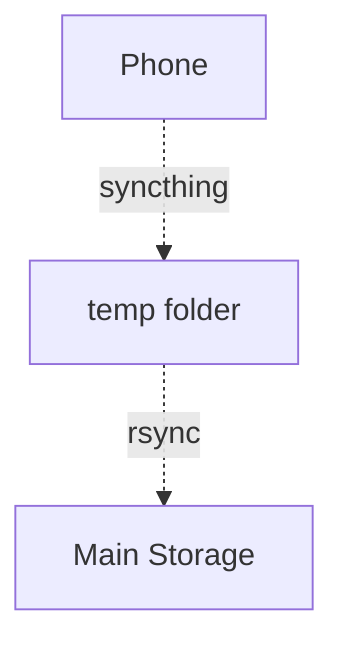

# Self-hosted Photo Library

## Pipeline
`syncthing` copies phone data to a temporary folder on the host continuously.

`rsync` copies data from the temp folder to the main storage when it's available.



Additionally `rsync` stores a backup on a second external storage (`scripts/backup_photos2.sh`).

Immich assets and its Postgres database are also backed up to main storage using `rsync` (`scripts/backup_immitch.sh`).

## Storage
For a start I use external USB drives (2 copies).
Both the library and the database live there for consistency.

Initial sync between storages:
`rsync -av --ignore-existing --progress /path/to/source/ /path/to/destination/`

Later I'd like to add a 3rd copy to S3 for offsite backup.

## Immich
Immich is used to edit/browse the collection. It's run via `docker compose`
(`docker-compose.yml`). Important notice: all external drives have to be mounted
before starting the stack.

## Scripts
- `scripts/backup_photos.sh` — rsync phone photos from the host to primary external storage. Scheduled every 30 min via `scripts/com.user.backup_photos.plist` (macOS launchd).
- `scripts/backup_photos2.sh` — same, to the secondary external storage. Not currently scheduled; run manually.
- `scripts/backup_immitch.sh` — backs up Immich assets and stops/starts the Postgres container to safely copy `postgres-data`. Run manually after stopping Immich.
- `scripts/duplicate_resolver.py` — calls the Immich API to find duplicate groups (via the ML duplicate-detection job), keeps the earliest-dated asset per group, and deletes the rest. Requires `IMMICH_URL` and `IMMITCH_DEDUP_API_KEY` env vars (see `.env.example`). Supports `--dry-run` / `--execute` and `--allow-name-mismatch`; logs every decision to `duplicate_resolver.log`.

### Setup
```
python3 -m venv venv
source venv/bin/activate
pip install -r requirements.txt
cp .env.example .env   # fill in IMMITCH_DEDUP_API_KEY and DB_PASSWORD
set -a; source .env; set +a   # export vars into the shell for duplicate_resolver.py
```

`docker compose` picks up `.env` automatically (it looks for one in the project directory), so `DB_PASSWORD` there also supplies the Postgres/Immich credentials in `docker-compose.yml`.

## What's missing / TODO
- **Offsite backup**: no 3rd copy exists yet (S3 or similar). Losing both external drives (e.g. theft, fire) loses everything.
- **No restore procedure documented**: there are backup scripts but no tested/written steps for restoring Immich (assets + Postgres dump) or photos from a backup copy.
- **No scheduling for `backup_photos2.sh` and `backup_immitch.sh`**: only `backup_photos.sh` runs automatically via launchd; the secondary-storage and Immich backups are manual and easy to forget.
- **No backup monitoring/alerting**: launchd writes logs to `~/Library/Logs/backup_photos.*`, but nothing checks them or notifies on failure (e.g. drive not mounted, rsync error).
- **`duplicate_resolver.py` defaults to a dry delete**: `delete_assets()` currently hardcodes `force=False` (see the `# TODO` in the source) even in `--execute` mode, so duplicates are only trashed, not permanently removed, until that's changed intentionally.
- **Immich library volume mounted read-only**: `docker-compose.yml` mounts the external library as `:ro` with a `# TODO remove :ro` note — Immich can't manage (e.g. delete/move) those assets until that's addressed.
- **No automated tests** for `duplicate_resolver.py`'s grouping/keep logic.
