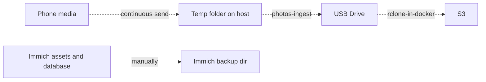

# Self-hosted Photo Library

## Table of Contents
- [My Pipeline](#my-pipeline)
- [Setup](#setup)
  - [Syncthing](#syncthing)
  - [Ingest](#ingest)
  - [Configs](#configs)
  - [HTTPS access (Caddy)](#https-access-caddy)
  - [S3 setup](#s3-setup)
  - [Backups](#backups)
- [Duplicates Resolution](#duplicates-resolution)
- [What's missing / TODO](#whats-missing--todo)

## My Pipeline
1. [syncthing](https://play.google.com/store/apps/details?id=com.github.catfriend1.syncthingandroid&hl=en) running on your phone (Send Only) publishes media to your host.
2. [syncthing](https://syncthing.net/) running on the host (Send & Receive) copies phone data to a temp folder — this happens regardless of whether the external drive or Docker is up
3. **[photos-ingest](services/ingest/README.md)**, a small Go service running on the host under launchd, watches that temp folder, transcodes large videos to HEVC, and mirrors everything into `$STORAGE_DIR`
4. [Immich](https://immich.app/) is used to browse and edit the collection, reading from that same folder.
5. **rclone** backs up `$STORAGE_DIR` to S3

Setup looks complicated, but it is built gradually and you are free to stop at any step and still have a working backup of your phone photos. The steps I took were:
* first, I had a **syncthing** saving my photos to a temp folder on host, and I lived like this for a couple of years
* next, I decided to have another copy on external drive, so I wrote a simple **rsync** script and scheduled it via launchd
* then, I tried **Immich** as a collection browser/deduplicator and it is just great, I almost forgot how much I loved Google Photos
* then, I added a **second syncthing** as a container that picks up from the temp folder and writes into Immich's storage folder, replacing the rsync hop. The external drive isn't 100% reliable and can be unplugged, and Docker itself can be down — keeping the host-level syncthing → temp folder step means the backup from the phone always lands somewhere even then
* then, I added container with **rclone** to back up the main storage to S3 regularly
* and finally, I replaced that container syncthing with **photos-ingest**. Syncthing is a mirror: it only knows how to make the destination look like the source, so it cannot transcode. Ingest re-encodes large videos to HEVC on the way through — 30-70% of the original size, metadata preserved. It runs as a host binary rather than a container because Apple's hardware encoder (`hevc_videotoolbox`) is unreachable from a Linux container on Docker Desktop


```mermaid
flowchart LR
    P[Phone media] -. continuous send .-> T[Temp folder on host]
    T -. photos-ingest .-> S[USB Drive]
    S -. rclone-in-docker .-> B[S3]
    I[Immich assets and database] -. manually .-> IB[Immich backup dir]
```

A quick note, if you have internal drive big enough for your media - lucky you are! No need to have a temp folder on host, you can just point Immich to the internal drive and skip the whole temp-folder hop. But if you have a small internal drive and want to keep your media on an external drive, this setup is for you.

## Setup

### Syncthing
Two syncthing instances are involved:
1. **Phone syncthing** (Send & Receive + ignoreDeletes) — sends photos to the host's temp folder.
2. **Host syncthing** (Send & Receive + ignoreDeletes) — stores the phone media into a temp folder. This is the part that always works even if the external drive is unplugged or Docker is down.

Important: folder mode "Send & Receive" should be used with advanced config option "Ignore Deletes", so that when you remove file on phone your host ignores it and leaves the copy and vice versa. At the same time "Send & Receive" allows devices have different sets of files and be ok with that.

From the temp folder onwards it is `photos-ingest`, not syncthing, that fills the drive — see below. There used to be a third, container-side syncthing doing that hop; it is left commented out in `docker-compose.yml` as a fallback and can be deleted once you trust ingest.

### Ingest
`services/ingest/` is the host service that takes over where syncthing stops: it watches the temp folder, transcodes large videos, and mirrors the result into `$STORAGE_DIR` — the folder Immich reads and `rclone` backs up (to the bucket root, keeping the same relative paths).

Why it is not a container: `hevc_videotoolbox`, the hardware encoder that makes transcoding fast enough to bother with, is not reachable from a Linux container on Docker Desktop. So it is a Go binary run by launchd.

```bash
brew install ffmpeg exiftool

cd services/ingest
make config ARGS='-source ~/SyncPhones'   # interview: writes <source>/.ingest/config.yaml
make install                              # build + install the binary
make install-plist SOURCES=~/SyncPhones   # write the LaunchAgent and load it
make logs                                 # tail the log
```

It defaults to **dry-run**: read a pass's output first, then set `dry_run: false` in `<source>/.ingest/config.yaml` and `make restart`. Config, state DB and per-file markers all live under `<source>/.ingest/`, and deleting a file from the drive does not bring it back — that record is the reason for the service.

`services/ingest/README.md` has the full story: the state key, adoption of an existing library, the `.ingest-dest` marker that stops it writing to an unmounted mount point, running several source trees as jobs in one process, and every config key.

This setup also anticipates an eventual move to a NAS: once storage lives there, ingest and Immich would just point at a network share instead of a local USB drive.

### Configs
Create your configuration from **example** files:
* `.env.example` → `.env` — Immich/API secrets (`DB_PASSWORD`, `IMMICH_DEDUP_API_KEY`), the host paths `docker-compose.yml` mounts (`IMMICH_DIR`, `STORAGE_DIR`), and `IMMICH_DOMAIN` for the `caddy` reverse proxy.
* `scripts/.env.example` → `scripts/.env` — everything the shell scripts need: phone/storage paths, AWS account/bucket, and the `rclone` remote's access keys. Source it before running any script by hand, e.g. `set -a; source scripts/.env; set +a`.

### HTTPS access (Caddy)
`caddy` reverse-proxies `immich-server` and gets/renews a Let's Encrypt cert automatically for `IMMICH_DOMAIN`. Requirements:
1. Point `IMMICH_DOMAIN`'s DNS at this host's public IP (a DDNS hostname works, e.g. `immich.funduckdev.ddns.net`).
2. Forward ports 80 and 443 from your router to this host (80 is needed for the ACME HTTP-01 challenge, not just redirects).
3. Set `IMMICH_DOMAIN` in `.env`.

Once up, Immich is reachable at `https://$IMMICH_DOMAIN`. `immich-server`'s port is no longer published to the host directly — only `caddy` is.

### S3 setup
1. Fill in `AWS_ACCOUNT_ID`, `AWS_BUCKET` and `EMAIL` in `scripts/.env`.
2. Run the commands in `scripts/aws_setup.sh` one at a time — it's a reference list, not a script meant to be executed as a whole, so review each command before running it. It covers:
   - `aws configure`
   - bucket creation
   - public-access block
   - default encryption
   - an IAM user/policy scoped for `rclone`
   - a $1 budget alert
3. Put the access key/secret it prints into `RCLONE_ACCESS_KEY` / `RCLONE_SECRET_ACCESS_KEY` in both `scripts/.env` and the root `.env` (see [Configs](#configs)).
4. Bring up `docker compose up -d rclone-s3-sync`.
   - It generates its own `rclone.conf` from those env vars.
   - By default (`RCLONE_SYNC_DRY_RUN=true`) it runs a dry-run sync on startup — check `docker logs rclone_s3_sync` to verify it lists the right files before trusting it with the real library.
   - Once verified, set `RCLONE_SYNC_DRY_RUN=false` in `.env` and restart the container.
   - For ad hoc `rclone` CLI checks against the same credentials (e.g. `rclone lsd`), exec into the running container and reuse the config it already generated: `docker exec rclone_s3_sync rclone lsd $RCLONE_REMOTE:$AWS_BUCKET --config /tmp/rclone.conf`.

### Start
Two halves, started separately:
```
docker compose up -d                       # Immich, Caddy, rclone-s3-sync
cd services/ingest && make install-plist   # photos-ingest, under launchd
```
Host syncthing runs on its own, outside both.

### Backups
* **Photos** (`$STORAGE_DIR`) go to S3 automatically through `rclone-s3-sync` (see [S3 setup](#s3-setup)).
* **Immich data** (`$IMMICH_DIR`: uploads, thumbnails, Postgres, configs) is backed up manually with `scripts/backup_immich.sh` to `$IMMICH_BACKUP_DIR` (set in `scripts/.env`, e.g. a folder on the external drive). The script:
  1. copies everything except `postgres-data` with `rsync --ignore-existing`, so files that already exist in the backup are not updated;
  2. stops `immich_postgres` if it's running, copies `postgres-data` in full, and starts the database again.

## Duplicates Resolution
Immich has a built-in functionality but when there are just too many duplicates with same names you can use `scripts/duplicate_resolver.py` to automatically delete these duplicates. 

It calls the Immich API to find duplicate groups (via the ML duplicate-detection job), keeps the earliest-dated asset per group, and deletes the rest.  

* Requires `IMMICH_URL` and `IMMICH_DEDUP_API_KEY` env vars (see `.env.example`).  
* Supports `--dry-run` / `--execute` and `--allow-name-mismatch`; logs every decision to `duplicate_resolver.log`. 

The images will be moved to bin, so you can restore them if needed, otherwise empty the bin and the images will be removed from the drive.

## What's missing / TODO
- **No restore procedure documented**: there are backup scripts but no tested/written steps for restoring Immich (assets + Postgres dump), photos from a backup copy, or the S3 archive.
- **No scheduling for `backup_immich.sh`**: it's manual, so it's easy to forget to back up Immich's assets and database.
- **No sync/backup monitoring or alerting**: nothing checks syncthing's sync status or ingest's failures and notifies on them (drive not mounted, sync stalled, transcode failing). Ingest at least records them — `photos-ingest -config $CFG -report` lists outstanding and failed work — but nobody is watching.
- **No source pruning in ingest**: `scripts/delete_copied_files.sh` compares source and destination by size and `cmp`, which stops being meaningful once a file has been re-encoded. Clearing the temp folder is manual and now needs care around transcoded videos.
- **Images are not transcoded**: ingest's rule list is shaped for an image rule, but only the video one exists.
- **`duplicate_resolver.py` defaults to a dry delete**: `delete_assets()` currently hardcodes `force=False` (see the `# TODO` in the source) even in `--execute` mode, so duplicates are only trashed, not permanently removed, until that's changed intentionally.
- **No automated tests** for `duplicate_resolver.py`'s grouping/keep logic.
